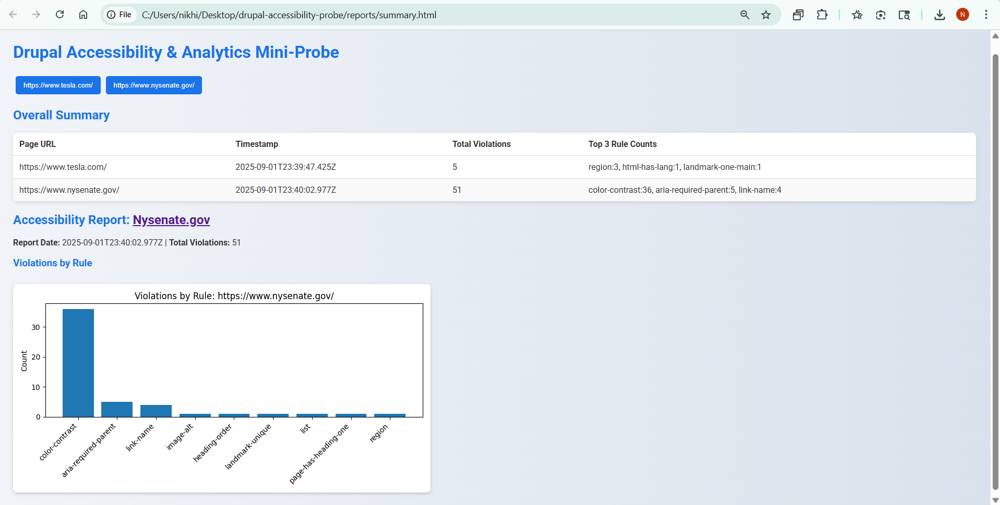

# Drupal Accessibility & Analytics Mini-Probe

## Purpose
Automates accessibility scans for web pages (including Drupal markup), collects WCAG 2.2 violations, persists scan results for trend analysis, and produces a compact HTML dashboard/report. Designed for fast setup and demo purposes.

## Problem Statement
Government web teams must ensure public-facing sites are accessible to all users. Manual audits are slow and inconsistent. This mini-probe provides:

- Automated accessibility checks (Playwright + axe-core)
- Persisted scan results (JSON + SQLite)
- Python analysis (pandas + matplotlib) for charts
- Unit and functional tests
- Lightweight HTML report/dashboard

**Success Criteria:** repeatable scans, JSON + DB persistence, charts generated, tests pass, demo-ready HTML summary.

## Architecture Overview

```
Target URL(s) --> Playwright (scan.ts + axe-core) --> latest_scan.json
                            │
                            │
                            ↓                            
                    validate.ts (JS checks)
                            ↓
                    (Optionally insert into SQLite)
                            ↓
                python/analyze.py -> pandas -> charts
                            ↓
                    reports/summary.html + charts
```

**Drupal Note:** scan rendered HTML; works with public Drupal pages, static pages mimicking Drupal, or optional Drupal sandbox.

## Demo Screenshot


## Setup & Run

**Clone repo:**
```powershell
git clone https://github.com/Nikhil123n/drupal-accessibility-probe.git
cd drupal-accessibility-probe
```

**Node & Playwright deps:**
```powershell
npm install

npx playwright install
```

**Run scan:**
```powershell
npm run scan
```

**Python venv & deps:**
```powershell
python -m venv venv

pip install --upgrade pip

pip install -r python\requirements.txt
```

**Run analysis:**
```powershell
python python\analyze.py

start .\reports\summary.html
```

## Testing

- **Unit tests:** `npm test`  
- **Playwright functional:** `npx playwright test`  
- Manual QA: run scan against a test page with known issues, verify JSON and charts.

## Accessibility Coverage (WCAG 2.2)

| Check | Axe Rule ID |
|-------|-------------|
| Images missing alt | image-alt |
| Form labels missing | label |
| Color contrast | color-contrast |
| Heading order | heading-order |
| Link names | link-name |
| ARIA landmarks | region |
| Tables without headers | table-duplicate-name |
| HTML lang attribute missing | html-has-lang |


## Next Steps
- Replace `targets.json` with real Drupal URLs or local sandbox pages  
- Schedule scans for trend tracking  
- Integrate with ticketing system for remediation tracking  


